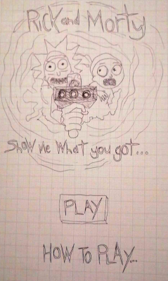
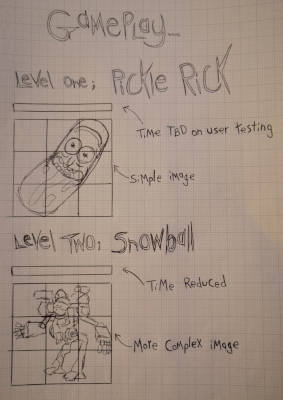
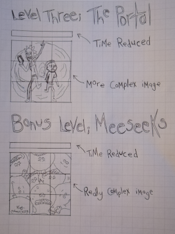
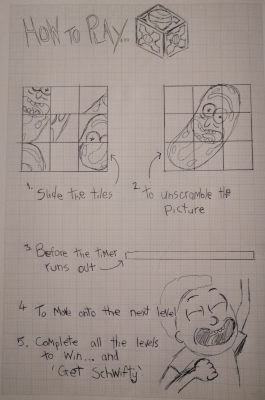
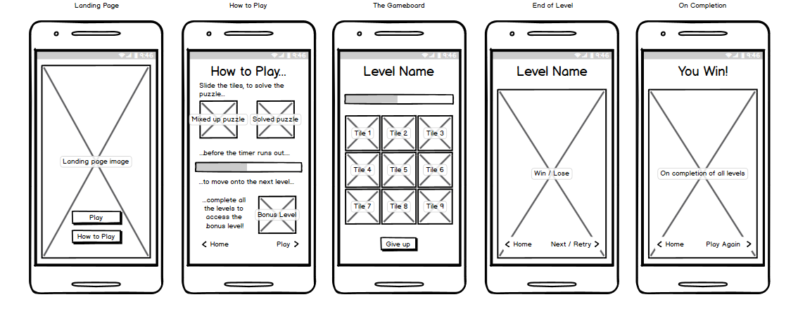
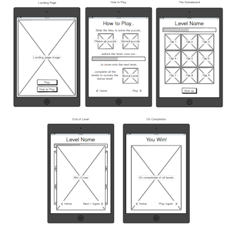
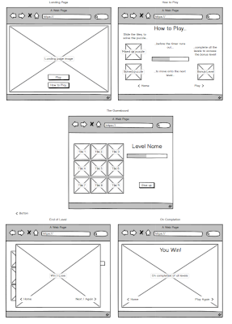

# **Show Me What You Got!**

[Show Me What you got!](https://bicks79.github.io/ShowMeWhatYouGot/) is a memory puzzle game based on the [Adult Swim](https://www.adultswim.com/) animated TV show [Rick and Morty](https://www.rickandmorty.com/).
It is the second of four major projects to be undertaken on the [Code Institute](https://codeinstitute.net/) Full Stack Developer software course.
The purpose of this project is to combine my experience of front end programming languages and produce a fully interactive site that demonstrates my knowledge and understanding of 
[HTML](https://www.w3schools.com/html/default.asp), [CSS](https://www.w3schools.com/css/default.asp) and [JavaScript](https://www.w3schools.com/js/DEFAULT.asp).

## **UX**
The purpose of the project is to create a fully interactive website/application using front end programming languages.
As a gamer, I decided to build a memory based puzzle game as I thought this would offer the most interactivity.
With this in mind, I started to ask myself questions about the project:

### **User Stories**
 - As a user, I want something fun to play.
 - As a user, I want to play something easy.
 - As a user, I want to be challenged.
 - As a user, I want to play something relatable.
 - As a user, I want to play something on my daily commute.
 - As a user, I want to play something different.
 - As a user, I want to know what options are available.
 - As a user, how do I play the game.
 - As a user, can I turn the audio on/off.
 - As a user, when do I know if I've won the game.
 - As a user, can I play again.
 - As a user, can I give up.
 - As a user, can I navigate my way through the game easily.

 These user stories became the groundwork for my project and helped me to understand what sort of game I could build that would best suit the brief.
 The game needed to be fun to play and keep the user involved at all times.  It needed to suit the users skill level and give them the option to select a game that they felt would be easy to play, or more challenging.
 Making the game relatable to the user was also a key requirement, which is why I opted for the content and theming based around [Rick and Morty](https://www.rickandmorty.com/). It has a large varied fan base, and had a huge amount of online content for me to utilise.

 I always had an idea of what I wanted the game to look like, what sort of memory game it could be, and the syle in which it would play.
 I drew out some initial sketches of what I would like to include in the game and how the layout of the site would look.

 
 
 
 

Just by putting these sketches together, I could see that my project had potential. However, I could see that creating several difficulty levels, with unique puzzles could prove too nuch, 
so to prevent myself from over commiting, I would need to be selective in what features I would include for my final designs.
I used my sketches to create more advanced wire frames, keeping the design as simple as possible to ensure that the project worked well responsively while remaining true to the theme and content material.
After doing some research on [Google Play](https://play.google.com/store?hl=en), I decided my project needed to have the look and feel of a mobile application to maximise UI.

Once I had created my mobile designs, I set about adjusting the content for larger devices.
As the content variation between devices was minimal, the construction of these wireframes was a quick process and adapted very cleanly from the mobile concept.
I now had the designs in place and could begin to focus on the features of the game.

## **Features**

### **Current Features**

#### **Brand**
[Rick and Morty](https://www.rickandmorty.com/) is a hugely popular, Award winning, animated TV show produced by [Adult Swim](https://www.adultswim.com/).
It has a large, varied fanbase (myself included) and I wanted to reflect the brand in my project.  As a developer, I had the opportunity create something with this project, 
that would be relatable and involving to fans of the show.

#### **Navigation**
For excellent UX/UI, moving through the game should be uncomplitcated. All buttons are labelled to help the user navigate their way through the site cleanly.
Each button opens up a new page or modal to give the user more information about the site.

- **Enter** - Takes the user from the landing page to the options menu.
- **Play** - Opens the 'play' modal. From here, the user can access the game by choosing what difficulty setting to play.
- **How to Play** - Opens the 'how to play' modal. Here, the user can read how to play the game, and use the in-game functions.
- **Audio** - Opens the 'audio' modal. From here, the user can control the game audio.

- **Menu Icon**  - During the game, the 'portal icon' returns the user back to the options menu.

- **Meeseeks Box**  - During the game, the 'meeseeks box' opens the 'how to play' modal.

- **Musical Notes**  - During the game, the 'musical notes' open the 'audio' modal.  

#### **Modals**
Each Modal allows the user to interact with the site depending on their personal choices.

- **Play Modal** - From here, the user can select a difficulty setting to play the game.  The options are 'Rick' (Easy 3x3 grid) or 'Morty' (Hard 4x4 grid).
    Once the user has selected, they are taken to their selected game page.
- **How to Play Modal** - The 'how to play' modal instructs the user how to play the game. It gives information about chosing their difficulty setting, starting the game,
    and what role the in-game icons have should they be selected.
- **Audio Modal** - The audio modal gives the user control over the game music and sound effects. Depending on personal preference, the user can turn the audio up/down or on/off.
- **Win Modal** - The win modal appears when the user completes the puzzle. The user has the option to try again, move onto the bonus level, or return to the options menu.

#### **Gameplay**
The game grid opens after the user has selected their difficulty. The game is based on the sliding tile puzzles that were frequent prizes in cereal boxes during the 80's/90's.
The user is required to look at and remember how the image pieces together. This fulfills the memory aspect of the brief. 
When ready, the user can click the 'shuffle' button to scramble the image.
The user is required to move the tiles around the board, using the blank space, to re-assemble the image.
On completion, the win modal appears to allow the user to chose from the options available.
- If the user has completed the initial puzzle, they have the option of trying again, or moving onto the bonus puzzle.
- If the user has completed the bonus puzzle, then they can either try again or return to the options menu.

#### **Footer**
The footer appears on the landing page and options page.  It informs the user who created the site and gives them access to explore my LinkedIn, GitHub and Instagram social media accounts.

### **Features Left to Implement**

#### **Timer**
During the development of the project, it became clear that there were features I could include to enhance the UX/UI.
Included in my wireframes was a timer that initially counted down to put pressure on the user and increase the thrill of the game. 
I decided against this as during testing it made the game very difficult to complete. Moving forward,
a timer is still something I would like to include, but one that counts up, informing the user on completion how quickly they solved the puzzle.
Users with a competetive nature would then be inclined to retry the puzzle to beat their time.

#### **Extra Puzzles**
To prevent repetetiveness and the user becoming bored with the application, I would like to include extra puzzles.
I feel a random puzzle generator from a library of images would keep the game fresh and offer a new challenge for user each time they play the game.

#### **Challenge mode**
While researching for the project, I was looking into algortihms and how they can be used to predict the outcome of a game.  
Many of the examples I looked at involved chess, showing how many moves the game could be won or lost in.
I thought that this would be a great feature to include, using the algorithm to work out the least amount of moves it would take to complete the puzzle,
then challenging the user to complete the puzzles inside a set number of moves.

#### **Win-Modal**
Like the 'extra puzzle' feature, I would want to update the win-modal so that a different image and audio clip were played on completing the puzzle.
This would help keep the game fresh and prevent the user from becoming bored with the application.

## **Technologies Used**

#### **HTML (Hyper Text Mark-up Language)**
- [Hypertext Mark-up Language (HTML)](https://www.w3schools.com/html/default.asp) is the standard mark-up language for documents designed to be displayed in a web browser It can be assisted by technologies such as Cascading Style Sheets (CSS) and scripting languages such as JavaScript. - Wikipedia 

#### **CSS (Cascading Style Sheets)**
- [Cascading Style Sheets (CSS)](https://www.w3schools.com/css/default.asp) is a style sheet language used for describing the presentation of a document written in a mark-up language like HTML. CSS is a cornerstone technology of the World Wide Web, alongside HTML and JavaScript. - Wikipedia

#### **JavaScript**
- [JavaScript]https://www.w3schools.com/js/DEFAULT.asp is the worlds most popular programming language, and the programming language of the web.

#### **Bootstrap**
- [Bootstrap](https://getbootstrap.com/) is a free and open source CSS framework directed at responsive, mobile-first front-end web development. It contains CSS and (optionally) JavaScript-based design templates for typography, forms, buttons, navigation, and other interface components. - Wikipedia

#### **GitHub**
- [GitHub](https://github.com/), is a United States-based global company that provides hosting for software development version control using Git. - Wikipedia

#### **Gitpod**
- [Gitpod](https://www.gitpod.io/), is open-source IDE (Integrated Development Environment) based on Eclipse Theia.  It is used to create, modify, and save code.

#### **Git** 
- [Git](https://git-scm.com/) is a distributed version-control system for tracking changes in source code during software development. It is designed for coordinating work among programmers, but it can be used to track changes in any set of files. Its goals include speed, data integrity, and support for distributed, non-linear workflows. - Wikipedia
 
#### **Web Development Tools** 
- [Web development tools](https://developers.google.com/web/tools/chrome-devtools) (often called dev-tools) allow web developers to test and debug their code. They are different from website builders and integrated development environments (IDEs) in that they do not assist in the direct creation of a webpage, rather they are tools used for testing the user interface of a website or web application. - Wikipedia

#### **W3C Validation**
- [Mark-up Validation Service](https://validator.w3.org/) is a validator by the World Wide Web Consortium (W3C) that allows Internet users to check HTML and XHTML documents for well-formed mark-up. Mark-up validation is an important step towards ensuring the technical quality of web pages. – Wikipedia

#### **GIMP**
- [GIMP](https://www.gimp.org/) is a free and open-source raster graphics editor used for image retouching and editing, free-form drawing, converting between different image formats, and more specialized tasks. - Wikipedia

## **Testing**
Testing this project has been difficult.  As a language, JavaScript did not come naturally to me and I have struggled putting the code together.
Testing both [HTML](https://www.w3schools.com/html/default.asp) and [CSS](https://www.w3schools.com/css/default.asp) was easy enough as I could utilise the
[Mark-up Validation Service](https://validator.w3.org/) as I did in my MS1 project.  
Testing my JavaScript has been more difficult as I have needed to rely on others, like tutor support and my mentor, who understand the language to help me ensure my code worked correctly.
My shortcomings in understanding JavaScript have had an adverse effect on my ability to produce and test code as well as I would have liked.

